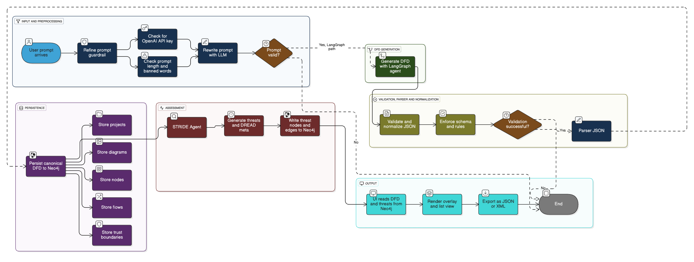

# cerebrus-ms-ai-agents

# CERBERUS - Continuous Ecosystem for Risk & Boundary Evaluation Remediations Using STRIDE/DREAD

## Project Overview
This repository is an individual contribution to the CERBERUS capstone project, focusing on the design and automation of a STRIDE-based threat modeling workflow using n8n. It enables the conversion of plain English system descriptions into Data Flow Diagrams (DFDs), which are then validated and analyzed for security risks using the STRIDE framework. The workflow simulates API integrations for DFD generation (via LangGraph) and security assessment.
# Agentic AI
Agentic AI refers to artificial intelligence systems designed to act autonomously with the ability to perceive their environment, make decisions, and take goal-directed actions to achieve specific objectives. Unlike reactive AI, agentic AI exhibits agency — meaning it can plan, adapt, and learn from interactions over time. These systems often incorporate multiple AI components working together, enabling complex problem-solving and self-directed behavior. Agentic AI is increasingly applied in areas like robotics, virtual assistants, and automated workflows, pushing the boundaries of intelligent automation.
# AI Agents
# 1. SDFD Agent (Security Data Flow Diagram Agent)
# Purpose: 
Specialized agent for analyzing data flow diagrams and identifying security vulnerabilities
# Capabilities:
1. Automated threat identification using STRIDE methodology
2. Data flow analysis and security boundary assessment
3. Vulnerability detection and risk evaluation
4. Security control recommendations
# Integration: Direct integration with the diagram canvas for real-time analysis
# LangGraph 
LangGraph, created by LangChain, is an open source AI agent framework designed to build, deploy and manage complex generative AI agent workflows. It provides a set of tools and libraries that enable users to create, run and optimize large language models (LLMs) in a scalable and efficient manner. At its core, LangGraph uses the power of graph-based architectures to model and manage the intricate relationships between various components of an AI agent workflow.
# System Architecture

# LangGraph Orchestration
SDFD agent is responsible for generating structured data flow diagrams which is then used to uncover potential risks. It works directly with the DFD canvas. Another agent brought together is threat assessment agent which takes the identified threats further by performing risk classification, evaluating impact and assigns threat levels also suggests mitigation measures. These two agents are orchestrated using LangGraph where each agent act as a node in dynamic execution graph. This orchestration ensures a modular, traceable and extensible system architecture. 
## API Integration
This workflow interacts with:
- `POST /generate-dfd` – Simulates LangGraph-based DFD generation
- `POST /analyze-stride` – Processes validated DFDs to extract STRIDE threats
## Technologies Used
- **n8n** – Workflow automation (tried but not implemented in CERBERUS)
- **SDFD Agent** – DFD generation from natural language
- **Threat Assessment Agent** – Threat modeling framework
- **Markdown** – Documentation
- **Git & GitHub** – Version control and collaboration
# Repository link
Group repository link - https://github.com/man-anr/cerberus

